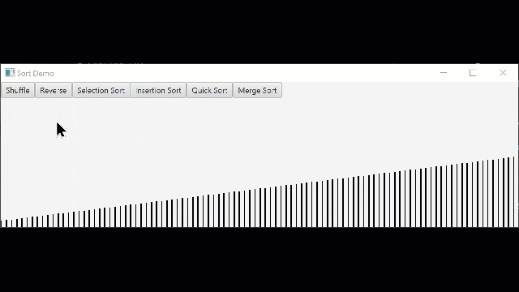

> Photo by <a href="https://unsplash.com/@edgr?utm_source=unsplash&utm_medium=referral&utm_content=creditCopyText">Edu Grande</a> on <a href="https://unsplash.com/s/photos/sorting?utm_source=unsplash&utm_medium=referral&utm_content=creditCopyText">Unsplash</a>

# Sorting GUI
In this project, you will be building on the ideas we have discussed in sorting and JavaFX. 

In this project, you will develop a Java program that demonstrates you can:
- Utilize known sorting methods to compare their efficiency
- Develop a GUI layout demonstrates sorting interactively

## Step 1 - Inspect the Included Classes
The included file, `SortDemo.java`, creates a basic GUI layout with two buttons. In the initial position, one hundred rectangles are created with heights in ascending order. Now, it's totally fine to play with some of these parameters here. You can make them slightly wider, make them higher up or lower, etc. So that you have the original parameters, they are provided again here. Each rectangle is created at x = i * 8 (spaced 8 pixels apart), height that increases with each value of i, y = 200 - height, and width of 2 pixels.

```java
for (int i = 0; i < 100; i++) {
    double x = i * 8;
    double height = i + 10;
    double  y = 200 - height;
    double width = 2;
    SortableRect rect = new SortableRect(x, y, width, height);
    rect.setValue(i);
    rectangles.add(rect);
}
```

These rectangles are a little different from our typical Rectangles. In addition to their screen positions, they also have a value that allows them to be easily compared to each other. While they do not implement comparable for this exercise, this is a common pattern in GUI development - a screen element that is also carrying some data around with it. In this case, the value of each rectangle is set by default to the order in which it was created. This also corresponds to the height, though if we wanted to change the heights we could do so without affecting the value each rectangle is carrying around. 

Each of the buttons call algorithms that are present in the `Algorithms.java` class:

The `Shuffle` button utilizes the Fisher-Yates shuffle algorithm to shuffle our list of rectangles into a random order. This is a generic static method that has been created to take any ArrayList of SortableRect objects (or child classes of SortableRect). 

The `Reverse` button reverses the order of the list of rectangles, whether they are sorted or shuffled. It's another good example of moving the rectangles around by swapping their position.



Something to pay close attention to here is the implementation of the swap. We want to show each swap as it occurs, and we want each swap to visibly happen slow enough so that the eye can detect the change. To accomplish this, we use a `TranslateTransition` in JavaFX, which slowly translates the position of a node to a new location over time. The code for this transition is provided for you in the `createTranslation` method:

```java
TranslateTransition t = new TranslateTransition(Duration.millis(duration), list.get(fromIndex));
t.setFromX(list.get(fromIndex).getLastX());
t.setByX((toIndex - fromIndex) * 8);
list.get(fromIndex).setLastX((toIndex - fromIndex) * 8);
return t;
```

This method understands that each index corresponds to a screen position. If a rectangle is currently at position 5, and needs to move to index 1, then it needs to move to the left. If it is at index 5 and needs to move to index 11, it needs to move to the right. Whatever it's current "from" position, it will need to move `by` a set interval to its new position relative to its old position. Each index is 8 pixels away from its neighbors, so to get screen positions, we multiply the difference between the from index to the to index * 8. The swap takes however long we set in the `duration`, in milliseconds. 

Something else to notice here is that we are staging the swaps to occur in order. Unfortunately, we cannot just show the swap on the screen and pause the execution of the program until the swap is done. We have to plan this out in advance, and then play out the actual visual elements after the fact. In the code below from the fisher-yates implementation, you can see that each swap is two separate transitions that happen in parallel. i moves to j, and j moves to i. Then, each of these transitions is added to the growing sequence of transitions that will be played all at the end once the algorithm is finished. 

```java
ParallelTransition p = new ParallelTransition();
TranslateTransition t1 = createTranslation(list, i, j, millis);
TranslateTransition t2 = createTranslation(list, j, i, millis);
p.getChildren().addAll(t1, t2);
sequentialTransition.getChildren().add(p);
```

This results in the following animation, which has been slowed down so that you can more easily see individual swaps:


**Deliverable 1:**
- Currently, the provided implementation of `reverse` has two different transitions for the movement of the elements. Update the `reverse` method so that both transitions for the swap occur in parallel.

> Note: Currently, each algorithm has its own timing for transitions set to 1000 millis, or one second. This rate is useful for getting a sense of what's happening, but feel free to speed it up as you are working on this by reducing it to a smaller amount.

## Step 2 - Implement an Inefficient Sort
Before beginning work on your sorting methods, you will need to review the four sorting methods described in the textbook. 

Both of the inefficient algorithms are relatively simple, and require very few lines. That's the good news. The bad news is that they're relatively slow, especially for very large lists. For each, you will need to adapt the model demonstrated in both the shuffle and reverse methods to the code provided in the textbooks.

### Selection Sort: 

A sorting algorithm that treats the input as two parts, a sorted part and an unsorted part, and repeatedly selects the proper next value to move from the unsorted part to the end of the sorted part.


### Insertion Sort: 

A sorting algorithm that treats the input as two parts, a sorted part and an unsorted part, and repeatedly inserts the next value from the unsorted part into the correct location in the sorted part.


Both algorithms are provided in the book using arrays instead of ArrayLists, so you will need to make some modifications. One of the more subtle changes is the use of the `Collections.swap(list, from, to)` method that will exchange the positions of two items in an arraylist. An example is given in the shuffle method. Note, the swap method only exchanges the positions in the data structure, but does not affect the visible position of elements. You'll need to use transitions for that. 

**Deliverable 2:** Create an implementation of selection sort or insertion sort that provides a visual representation of the movement of elements at each stage of the algorithm.

## Step 3 - Implement an Efficient Sort

Before beginning work on your sorting methods, you will need to review the four sorting methods described in the textbook.

Both of the efficient algorithms are more complex, and require several more lines of code and recursive method calls. That's the bad news. The good news is that they're relatively fast, especially for very large lists. For each, you will need to adapt the model demonstrated in both the shuffle and reverse methods to the code provided in the textbooks.

Like the implementations for the inefficient algorithms, the examples in the book use arrays instead of ArrayLists and will need to be adapted. Also, since both of the efficient algorithms are recursive, you will need to add additional parameters to account for the sequential transitions that are being built up over time.

### Quick Sort

A sorting algorithm that repeatedly partitions the input into low and high parts (each part unsorted), and then recursively sorts each of those parts. To partition the input, quicksort chooses a pivot to divide the data into low and high parts.


### Merge Sort

A sorting algorithm that divides a list into two halves, recursively sorts each half, and then merges the sorted halves to produce a sorted list. The recursive partitioning continues until a list of 1 element is reached, as list of 1 element is already sorted.


> Note: Merge sort does not use swaps. Instead, items are placed into a separate list. While a bit more intuitive than quick sort, creating a visual representation of merge sort is a little trickier. Instead of a single swap transition, you will need to create translate transitions in up to four different parts of the merge algorithm (depending on your implementation). 

**Deliverable 3:** Create an implementation of quick sort or merge sort that provides a visual representation of the movement of elements at each stage of the algorithm.

## Step 4 - Add Buttons

For each of your two chosen sorting algorithms, create a button that can trigger the algorithm. Add these buttons to the HBox that is already present in the GUI pane. 

As you are working on the sorting methods, it can be helpful to output the sorted list to System.out to verify that the sorting is occuring. Sometimes the data is being sorted correctly but the visual representation is not quite ready.

**Deliverable 4:** Create buttons that trigger your inefficient and efficient sorting methods. Add them to the GUI.
